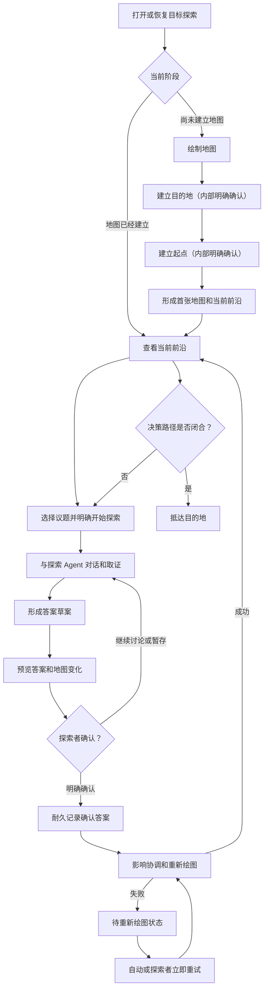

# Spec：人驾目标探索框架

Status: draft
Implementation status: partial

## 目的

本文定义 Wayfinder Explorer 第一阶段的“人驾”目标探索框架：探索者负责选择探索方向和确认真实判断，地图 Agent 与探索 Agent 负责调查、形成提案和维护一致性，Explorer 负责执行规则、持久化状态和恢复失败。

“人驾”是本文使用的实现阶段名称，不新增领域状态，也不改变 `CONTEXT.md` 中的目标探索语义。第一阶段先走通完整的人驾闭环；后续 AI 探索应复用相同的领域操作和状态规则，而不是复制一套自动化流程或模拟浏览器点击。

## 目标

- 让探索者能够从模糊目标开始，完成目的地确认、起点确认、推进地图、答案确认、答案修订和抵达判定。
- 保证答案草案在探索者明确确认之前不会成为地图事实。
- 让探索者在确认前看到候选答案及其地图影响预览，但不要求逐项审批可以可靠推导的机械变化。
- 保证答案确认、影响协调和重新绘图具有明确顺序，并能在进程退出、写入失败或外部编辑后安全恢复。
- 把跨探索会话、写回和重新绘图的复杂顺序收进一个人驾目标探索模块，避免 HTTP 路由或页面自行编排领域流程。
- 为后续 AI 探索保留统一的操作语义，但不在只有一个调用者时提前建立假想的驾驶器 seam。

## 非目标

- 本阶段不实现 AI 自动选择议题、自动循环探索或自动确认答案。
- 本阶段不允许地图 Agent 或探索 Agent 代替探索者作出真实判断。
- 本阶段不负责执行答案描述的现实工作；抵达目的地只表示决策路径闭合。
- 本阶段不重新设计地图导航、右侧对话区或既有操作入口。
- 本阶段不增加一套独立的人工改图、逐节点复核或重新绘图整体确认流程。
- 本文不规定具体 Agent 运行时；Codex Thread 或未来运行时都必须服从相同领域规则。

## 核心定义

人驾目标探索遵循一个简单分工：

> 探索者负责决定，Agent 负责帮助形成和协调认识，Explorer 负责让决定可靠地进入同一张持续演化的地图。

| 角色 | 负责 | 不负责 |
| --- | --- | --- |
| 探索者 | 确认目的地和起点；选择、认领和结束探索；审阅答案草案；确认或修订答案；处理真实判断冲突 | 手工同步地图、路线、议题、探索上下文和历史 |
| 地图 Agent | 主持绘制地图；在答案确认或修订后分析显式依赖与语义关联；形成地图变化提案 | 直接写规范地图；替探索者确认答案或复核真实判断 |
| 探索 Agent | 围绕一个已认领议题持续对话、取证并形成答案草案 | 直接创建地图节点；修改其他议题；确认答案 |
| Explorer | 校验操作和提案；维护认领、顺序和版本；展示预览；写入确认答案；重新绘图；持久化和恢复 | 发明探索者意图；把未经确认的草案投影为事实 |

## 不可破坏的规则

1. **确认权属于探索者。** 目的地、起点、确认答案、修订答案和复核答案都必须来自探索者的明确操作。
2. **议题不是地图节点。** 当前选中状态、正在探索状态和答案草案都不会产生地图节点或确定路线。
3. **确认先于派生变化。** 答案一经耐久确认便成为事实；影响协调和重新绘图失败不能撤销它。
4. **机械变化不逐项审批。** 地图 Agent 可以自动协调能够可靠推导的议题、关系、路线、上下文和草案变化；只有真实判断冲突交还探索者。
5. **同一张图持续演化。** 修订和复核保留地图节点身份、位置、答案历史与探索历史，不创建重复节点或另一张地图。
6. **确认按顺序落图。** 同一次目标探索中的确认串行处理；后一项必须基于包含前一项结果的最新地图。
7. **待重新绘图时不使用旧前沿。** 已开始的探索可以继续，但不能从旧前沿开始新探索，后续确认暂停。
8. **页面不掌握领域顺序。** 页面表达探索者操作和呈现返回状态，不直接串联写回、影响协调与重新绘图。

## 人驾闭环



## 阶段一：绘制地图

### 1. 建立目的地

探索者从模糊目标开始，与地图 Agent 澄清可观察的目标状态。地图 Agent 可以提问、调查和总结，但只有探索者通过 Explorer 的确认目的地操作明确接受当前草案后，目的地节点才成立；确认目的地是建立目的地内部的专门操作，不是另一个阶段。

目的地确认后由 Explorer 独立保存。修改已确认目的地前，Explorer 必须执行目的地变更可达性检查：只有原起点和探索对象仍然有效、现有确认与探索内容能够通过正常修订和影响协调恢复一致、且已有约束未证明新目的地不可达时，才允许在同一次目标探索中修改。检查不通过时保留当前探索历史，并建立新的目标探索；不能把现有目的地静默改写成另一件事。

### 2. 建立起点

地图 Agent 在检查现有环境前与探索者了解探索背景，并约定哪些资料可以作为证据。取证范围是建立起点的内部约束，不是独立用户阶段或确认操作；它允许观察事实，但不自动授予写入、发布或其他副作用权限。

地图 Agent 根据定向取证结果形成统一的当前现状摘要，并把形成依据绑定到确切证据版本。探索者通过 Explorer 的确认起点操作接受草案的确切内容；Explorer 重新校验证据版本仍然有效后，才独立保存并冻结起点节点。证据变化会使旧草案失效，后续环境变化不会静默重写已经确认的历史基线。

### 3. 形成首张地图

首张地图包含：

- 已确认的起点节点。
- 已确认的目的地节点。
- 当前能够明确表达的议题。
- 尚不能明确为议题的迷雾。
- 已知范围边界和议题依赖。

首张地图不能因为起点和目的地同时存在就绘制虚构的确定路线。地图只展示由当前有效确认答案支持的路线。

## 阶段二：推进地图

### 1. 查看与选择

Explorer 从规范记录投影当前前沿。探索者点击某个议题只改变当前选中状态，不产生认领、探索会话、地图节点或确定路线。

页面应同时保留其他前沿议题的可见性，不把当前选中误解为唯一“下一步”。

### 2. 明确开始探索

探索者明确开始处理议题时，Explorer 原子地取得认领并建立或恢复对应的探索 Agent 会话。认领成功后，其他会话不能重复开始同一个议题。

待重新绘图状态下禁止从旧前沿开始新探索。普通查看不受此限制。

### 3. 持续讨论与取证

探索者和探索 Agent 在同一个持续会话中交流。探索 Agent 可以在取证范围和运行时权限内读取文件、调用工具并观察最新环境；任何普通项目写入或外部副作用仍服从运行时沙箱与审批。

探索者可以：

- 发送回答和补充条件。
- 要求继续调查或解释证据。
- 停止当前 Agent 思考。
- 形成答案草案。
- 暂存答案草案后稍后恢复。
- 主动结束探索。

主动结束探索会释放认领，并把会话和已有内容保存为未完成历史；它不会确认答案或创建地图节点。

### 4. 形成答案草案

探索 Agent 返回的候选结论始终是答案草案。Explorer 必须把它与当前确认答案、地图事实和确认操作区分显示。

形成草案后，探索者可以继续讨论、暂存或者请求预览地图变化。离开页面、结束一轮 Agent 输出或仅仅形成草案都不等于确认。

## 阶段三：预览与确认

### 1. 预览

预览是基于候选答案和精确源 revision 的无副作用演算。它至少展示：

- 准备确认的答案草案。
- 修订时的当前答案与替代答案差异。
- 首次确认将形成的地图节点。
- 预计变化的议题、依赖、确定路线、迷雾和当前前沿。
- 预计需要协调的正在探索状态和答案草案。
- 可能成为待复核答案的真实判断冲突。
- 不变内容以及变化原因。

地图 Agent 可以为预览形成结构化地图变化提案，但不能直接写文件。Explorer 必须校验提案、在内存中投影完整结果，并拒绝破坏稳定身份、认领、历史、路径安全或图一致性的内容。

预览不是事实，也不改变确认状态。最终影响协调仍由明确确认触发；确认时必须重新校验预览所依据的 revision 和相关内容。

### 2. 探索者决定

探索者面对预览只有一个领域确认：是否接受当前答案草案。

- 不接受：返回原探索会话继续讨论或暂存草案，不产生正式变化。
- 接受：提交确认操作，进入有序、可恢复的写入流程。

重新绘图不会再增加一次整体确认。可以可靠推导的变化默认应用并显示，探索者可以按既有规则恢复最近一次重新绘图对尚未开始议题的修改或待删除标记。

### 3. 确认执行顺序

每次确认必须按以下顺序执行：

1. 校验认领者、当前会话、答案草案和预览计划仍然有效。
2. 校验源 revision、提案摘要和受影响内容未被外部修改。
3. 为该确认取得同一次目标探索内的单调顺序。
4. 耐久记录确认答案或修订答案及其历史。
5. 让新确认节点或新的当前答案立即进入事实投影。
6. 触发地图 Agent 的最终影响协调，并重新校验或刷新预览阶段的提案。
7. 通过可恢复写入应用重新绘图结果。
8. 成功后更新当前前沿、释放相应认领并处理下一项排队确认。

任何外部编辑使预览失效时，Explorer 必须保留外部版本、不执行部分写入，并要求重新预览。探索者无需手工比较内部文件。

## 阶段四：修订与复核

### 修订答案

探索者可以重新打开已有确认答案的地图节点，继续原探索会话并形成替代答案。替代答案在明确确认前仍是答案草案，当前确认答案继续有效。

修订确认后：

- 旧答案进入不可变历史。
- 替代答案成为当前答案。
- 地图节点保持同一身份和布局位置。
- 影响协调更新所有可可靠推导的后续内容。
- 不再被当前答案支持的连接退出确定路线。

### 复核答案

只有既有探索者判断与新前提存在真实冲突、且地图 Agent 无法从已表达意图可靠推断时，才产生待复核答案。

待复核答案：

- 保留在同一地图节点。
- 保留当前答案和历史。
- 暂时不作为当前确定事实。
- 相关连接不属于确定路线。
- 阻止抵达目的地。

探索者在原节点和原操作流程中复核，可以确认原答案仍成立，也可以形成并确认替代答案。复核不创建第二套工作流。

## 阶段五：失败与恢复

| 失败位置 | 可观察结果 | 恢复规则 |
| --- | --- | --- |
| 预览形成前或形成中 | 没有正式变化，答案草案仍保留 | 修正问题后重新预览 |
| 确认答案耐久写入前 | 不产生确认答案，不允许部分文件覆盖 | 保留原规范内容并重新预览或确认 |
| 确认答案已经耐久记录、重新绘图尚未完成 | 新答案继续是已确认事实，地图进入待重新绘图状态 | 自动重试并允许探索者立即重试，不再次确认答案 |
| 重新绘图恢复过程中再次失败 | 保持同一待重新绘图项目，不重复历史或变化 | 幂等重试直到成功或暴露可处理错误 |
| 预览后发生外部编辑 | 预览失效，外部版本保持原样 | 基于最新 revision 重新形成预览 |
| 进程在任意耐久阶段退出 | 重启后重放相同事实和待办状态 | 从日志与写入 journal 向前恢复，不猜测或回滚确认 |

待重新绘图期间：

- 新确认节点立即可见。
- 其余地图保留上一次成功重新绘图的结果。
- 页面明确显示当前前沿尚未更新。
- 已开始的探索可以继续对话。
- 不能从旧前沿开始新探索。
- 后续答案确认进入队列但不能越过失败项。
- 不能判定抵达目的地。

## 抵达目的地

抵达目的地只能在一次成功重新绘图后判定，并同时满足：

- 没有当前前沿中的未解决议题。
- 没有仍被阻塞的开放议题。
- 没有正在探索状态。
- 没有待复核答案。
- 没有待重新绘图状态。
- 尚未明确的迷雾已经清空。
- 其余内容已经形成确认答案，或明确退出范围并进入相应历史。

抵达表示探索阶段的决策路径已经闭合，不表示现实工作已经执行完成。

## 人驾目标探索模块

### 模块职责

新增一个人驾目标探索模块，作为浏览器和领域实现之间的唯一编排位置。模块隐藏以下复杂性：

- 当前允许哪些探索者操作。
- 认领、会话和答案草案生命周期。
- 预览计划的创建、失效和版本校验。
- 确认顺序和并发排队。
- 确认答案与派生重新绘图的耐久阶段。
- 待重新绘图状态、幂等重试和重启恢复。
- 地图 Agent 与相关探索 Agent 之间的影响协调。
- 最终 Explorer 投影和错误表达。

### 外部 Interface

概念上，页面只需要两个主要操作：

```ts
interface HumanExplorationModule {
  open(campaignId: string): Promise<HumanExplorationView>;
  perform(
    campaignId: string,
    action: HumanExplorationAction,
  ): Promise<HumanExplorationView>;
}
```

这段类型用于说明模块形状，不冻结最终 TypeScript 命名。HTTP 长轮询、事件流或增量消息可以作为传输实现，不应迫使页面了解内部管理器的调用顺序。

`HumanExplorationView` 应向页面提供：

- 当前地图和当前前沿。
- 当前选中内容所需的详情。
- 正在探索状态、Agent 会话输出和答案草案。
- 当前答案、答案历史和待复核状态。
- 地图变化预览及其失效状态。
- 待重新绘图、确认排队和恢复进度。
- 当前允许的探索者操作及不可执行原因。
- 面向探索者的错误信息，不暴露运行时私有标识。

`HumanExplorationAction` 应表达既有用户操作，而不是内部管理器方法：

- 开始绘图。
- 发送绘图阶段回答。
- 确认目的地。
- 确认起点。
- 选择或打开节点、议题。
- 开始探索。
- 发送回答。
- 停止当前 Agent 思考。
- 形成答案草案。
- 继续讨论。
- 暂存或恢复答案草案。
- 预览地图变化。
- 确认写回。
- 主动结束探索。
- 恢复议题。
- 立即重试重新绘图。

当前选中状态如果只影响单个浏览器的展示，可以继续由页面本地维护；一旦它影响服务端允许操作或跨设备恢复，才进入模块状态。不能为了接口整齐而把纯展示状态伪装成领域事实。

### 内部 Implementation

第一阶段复用现有实现，不重写已经成立的能力：

| 现有实现 | 在人驾目标探索模块中的职责 |
| --- | --- |
| `ExpeditionManager` | 探索 Agent 会话、认领、对话、答案草案、继续讨论、暂存和结束探索 |
| `ChartingManager` | 地图 Agent 会话、首图绘制、影响协调、重新绘图调度和待重新绘图恢复 |
| `WritebackService` | 精确版本预览、确认答案的原子写入、journal 和本地文件恢复 |
| `RechartService` | 重新绘图提案校验、投影、规范内容更新和幂等恢复 |
| Journey/Charting stores | 耐久事件、确认顺序、会话身份、待办状态和重启重放 |

这些类可以继续作为模块内部实现。浏览器 HTTP 层不再分别调用它们，也不再负责“先确认写回，再调用重新绘图”的领域顺序。

### Seam 决定

- 浏览器到人驾目标探索模块是本阶段的外部 interface；HTTP 只是其 adapter。
- Agent 运行时存在真实变化需求时，由稳定的 Agent 会话 interface 和具体运行时 adapter 承担，不把 Codex Thread 标识泄漏到领域操作。
- 地图变化提案提供者需要生产 adapter 和确定性 fake adapter，因此是用于测试和运行时替换的真实 seam。
- 本阶段不创建抽象的 `HumanDriver`/`AIDriver` seam。现在只有浏览器代表探索者；等 AI 成为第二个实际调用者时，再让两者复用同一组可观察状态和领域操作。
- 本地 Markdown、overlay、事件日志和 journal 使用真实临时目录进行测试；不为每个本地文件类额外暴露 mock seam。

## 当前项目与目标框架的差距

当前项目已经具备大部分底层能力，包括持续探索会话、答案草案、直接写回预览、原子文件写入、答案历史、待复核节点、重新绘图校验、待重新绘图恢复和稳定地图节点投影。下面描述的是当前工作树与本文目标框架之间的交付差距，不会反向改变 `CONTEXT.md` 和有效 ADR 中的领域契约。

本轮已经收拢两个端点的建立流程：地图 Agent 形成草案，Explorer 提供确认目的地和确认起点操作；普通消息不能推进阶段；起点草案绑定并在确认时重新校验证据版本；确认内容先于首图草案独立持久化；首图提案只能引用而不能改写两个端点。

仍需收拢的关键差距是：

1. 已确认目的地尚无受控修改入口和目的地变更可达性检查；外部 Markdown 刷新也会直接接受目的地变化。
2. HTTP 确认路由当前先调用 `ExpeditionManager.confirmWriteback`，再自行调用 `ChartingManager.rechartAfterConfirmation`。跨模块耐久顺序仍由传输层掌握。
3. 当前写回预览主要覆盖答案和直接地图写回；完整影响协调提案在确认后才由重新绘图流程形成，探索者无法在一个计划中看到候选答案的全部预计影响。
4. 当前队列主要是重新绘图队列，而不是从确认入口开始覆盖“排队、耐久确认、影响协调、恢复”的完整确认队列。后一答案可以先成为地图事实，再让对应重新绘图进入队列。
5. Journey 与 Charting 分别记录状态；答案已经确认但尚未耐久登记重新绘图请求时，跨模块交接仍可能留下恢复空隙。协调提案本身也没有完整耐久记录，重试可能重新请求地图 Agent。
6. 部分探索上下文更新可能在完整重新绘图提案通过全部领域校验和规范写入前被消费，需要把“验证、规范写入、对外投影”的次序集中管理。
7. 协调 proposal 只有顶层证据引用和逐项自由文本原因，尚不能要求每项变化携带可验证证据与规范化原因类别，也不能可靠拒绝没有逐项依据的过宽变化。
8. 直接修订只替换当前答案和历史，重新绘图又禁止修改已确认议题；因此已确认节点自身的可推导依赖和路线有效性尚不能随修订安全协调。
9. 当前前沿投影只根据规范 issue 状态和依赖计算，没有排除已认领议题，也会把依赖待复核答案的开放议题错误投影为可探索前沿。
10. 终局收束尚未保证待删除议题一定得到最后一次复核和归档；基础投影也可能在没有最近一次成功重新绘图的情况下先显示抵达。
11. HTTP 和页面仍分别推导操作顺序与按钮可用性，公共视图还包含具体运行时的 `threadId`；尚未形成本文定义的统一 `HumanExplorationView` 和允许操作投影。

目标框架不推翻这些实现，而是用一个更深的人驾目标探索模块把顺序、失败和恢复隐藏起来。

## 实施顺序

### 第一步：锁定人驾验收流程

通过最高层 Explorer HTTP seam 建立以下行为测试：

- 从明确确认目的地、在建立起点内部约定取证范围并确认起点，到形成首张地图。
- 从当前前沿认领议题、持续讨论、形成草案和预览。
- 首次确认后形成地图节点和确定路线。
- 修订后保留旧答案、节点身份和布局位置。
- 真实冲突进入同节点待复核，并可确认原答案或修订。
- 接近同时确认时严格按顺序处理。
- 确认后重新绘图失败、重启和幂等重试。
- 预览后外部编辑导致计划失效且不覆盖外部内容。
- 没有开放议题和迷雾后才能抵达目的地。

### 第二步：引入人驾目标探索模块

先让新模块包住现有 `ExpeditionManager`、`ChartingManager`、`WritebackService` 和 `RechartService`，保持页面操作和领域行为不变。HTTP 路由改为调用模块，不再编排跨管理器顺序。

### 第三步：统一预览和确认生命周期

把候选答案、地图变化提案、精确源 revision、投影结果和相关内容摘要组成一个不可变预览计划。确认入口统一负责计划校验、顺序分配、答案耐久记录、重新绘图交接和恢复状态。

### 第四步：封闭跨模块恢复空隙

补充能够重放确认顺序、答案耐久阶段、影响协调请求、提案、应用、失败和重试的记录。重启恢复只向前完成未结束阶段，不回滚已确认答案，也不重复写入历史。

### 第五步：简化页面

页面只渲染 `HumanExplorationView` 并提交允许的探索者操作。按钮是否可用、确认是否排队、预览是否失效和重新绘图是否待处理均来自模块状态，不在 React 代码中复制领域判断。

## 验收标准

- 探索者能够通过现有地图和对话入口完成从绘制地图到抵达目的地的完整人驾闭环。
- 所有确认点均由探索者明确触发，Agent 输出和运行时审批不能替代领域确认。
- 未确认的议题、正在探索状态和答案草案不会成为地图节点或确定路线。
- 确认前的预览能够展示候选答案和完整预计地图影响，且不修改规范内容。
- 答案一经耐久确认，不会因为重新绘图失败、进程退出或重试而回滚或重复写入历史。
- 多个确认按顺序处理；后一项不能越过待重新绘图的前一项。
- 修订与复核保留同一个地图节点、位置、会话和历史。
- 待重新绘图时旧前沿不可用于开始新探索，已有探索可以继续，抵达判定被阻止。
- 外部编辑会使旧预览失效，且外部版本不会被部分覆盖。
- HTTP 和页面不再掌握写回与重新绘图的内部调用顺序。
- 测试主要通过与浏览器相同的 Explorer HTTP 操作观察页面快照、规范 Markdown、历史和重启结果；只有外部 Agent 提案使用确定性 fake。

## 与后续 AI 探索的关系

人驾阶段完成后，AI 探索可以采用相同循环：

```text
读取当前可观察状态
→ 从当前允许操作中选择一项
→ 提交领域操作
→ 观察新状态
→ 判断继续、等待或停止
```

后续 AI 不应调用内部管理器、不应直接修改规范地图，也不应通过自动点击浏览器复制人驾流程。它应与浏览器复用同一组领域操作和状态规则。

“AI 可以探索”与“AI 可以替探索者确认真实判断”是两个不同能力。前者可以在本框架上增加；后者会改变当前确认权规则，必须另行形成产品决定和 ADR，不能作为自动化实现细节静默引入。

## ADR 一致性

本文遵循当前领域词汇和以下有效决定：

- ADR-0002：确认后重新绘图。
- ADR-0003/0004：先明确确认目的地，再在建立起点内部约定取证范围、定向取证并明确确认起点。
- ADR-0006：初始地图不绘制虚构路线。
- ADR-0011：探索状态不是地图节点。
- ADR-0014：重新绘图自动应用并显示变化，不增加整体确认。
- ADR-0016：并行探索的答案按确认顺序重新绘图。
- ADR-0017：重新绘图失败不撤销答案确认。
- ADR-0019：待重新绘图时不开始新探索。
- ADR-0022/0023：待删除议题需要再次评估，抵达前必须完成终局收束并归档无用的未开始议题。
- ADR-0024/0025：抵达目的地意味着决策路径闭合并遵循穷尽语义。
- ADR-0028：已确认答案可以在同一次目标探索中修订。
- ADR-0031：待复核答案保留在同一张图的同一节点。
- ADR-0035：AI 协调可推导影响，只把真实判断冲突交还探索者。
- ADR-0036：Agent 是逻辑角色，具体运行时绑定不进入领域操作或公共投影。
- ADR-0037/0038：Agent 会话持续存在、能够观察真实环境并以权限约束副作用。
- ADR-0039：运行时抽象不改变既有用户操作。
- ADR-0040：目的地和起点都由 Explorer 的专门操作明确确认，普通消息不能替代确认。
- ADR-0041：修改已确认目的地前先检查当前目标探索是否仍然可达。

预览阶段对候选答案进行无副作用影响演算，不与“确认后触发最终影响协调”冲突：预览只帮助探索者理解预计结果；确认仍是事实成立和最终重新绘图的唯一触发点。
